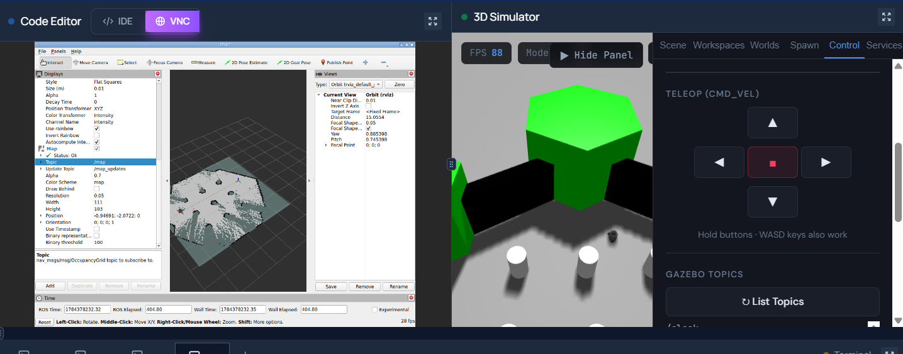
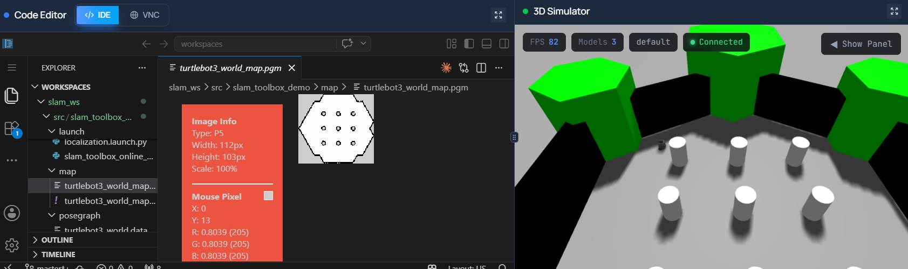
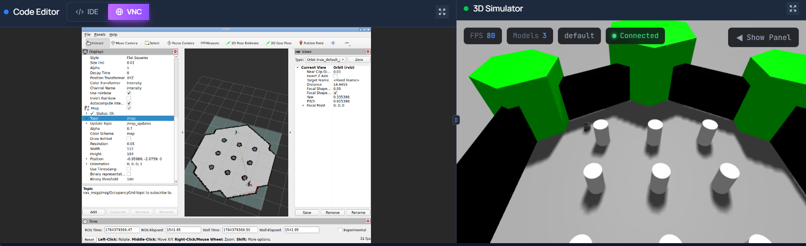
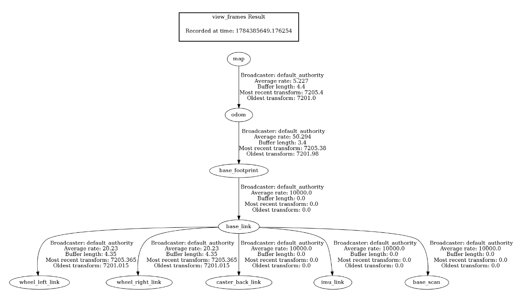
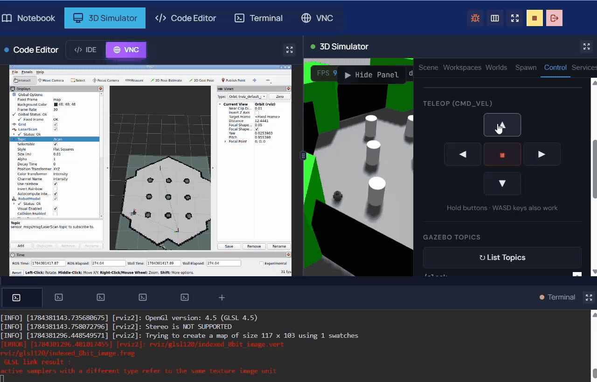

# slam_toolbox_demo — Session 7: Map the World and Localize the Robot Within It

## 1. Project Overview

This package demonstrates a complete SLAM (Simultaneous Localization and Mapping)
workflow using **SLAM Toolbox** in ROS 2, running on the **ETGAH cloud platform**
(no local ROS 2 / SLAM Toolbox installation required — the environment comes
pre-configured).

The simulation uses the standard **TurtleBot3** robot in the **turtlebot3_world**
Gazebo environment.

The project has two phases:

1. **Mapping** — drive the robot through the unknown world using keyboard teleop
   while SLAM Toolbox builds a live occupancy grid map from LiDAR (`/scan`) and
   odometry (`/odom`) data. The finished map and its pose graph are saved to disk.
2. **Localization** — reload that saved map and pose graph, and have the robot
   determine its own position within the already-known map using LiDAR scan
   matching, without building any new map data.

## 2. Package Structure

```
slam_toolbox_demo/
├── config/
│   ├── slam_toolbox_online_async.yaml   # Mapping mode parameters
│   └── slam_toolbox_localization.yaml   # Localization mode parameters
├── launch/
│   ├── slam_toolbox_online_async.launch.py   # Launches SLAM Toolbox in mapping mode
│   └── localization.launch.py                # Launches SLAM Toolbox in localization mode
├── map/
│   ├── turtlebot3_world_map.yaml        # Saved occupancy grid metadata
│   └── turtlebot3_world_map.pgm         # Saved occupancy grid image
├── posegraph/
│   ├── turtlebot3_world.posegraph       # Serialized SLAM pose graph
│   └── turtlebot3_world.data            # Serialized SLAM pose graph data
├── screenshots/
│   ├── GeneratingMapProcess.png         # Map being built live during mapping
│   ├── SavedMapFileView.png             # Saved .yaml/.pgm map files
│   ├── CompletedMapRviz.png             # Finished map in RViz
│   ├── tf.png                           # TF tree image
│   └── tf_tree.pdf                      # TF tree (original PDF export)
├── videos/
│   ├── CreatingMap.mp4 / .gif           # Mapping phase demo
│   ├── WrongPose.mp4                    # Wrong 2D Pose Estimate demo
│   ├── 2DPose.mp4                       # Correct 2D Pose Estimate demo
│   ├── RobotMovingInSavedMap.mp4        # Localization confirmed while driving
│   └── MovingAroundCreatedMap.mp4 / .gif
├── CMakeLists.txt
├── package.xml
└── README.md
```

**Note:** SLAM Toolbox itself does not launch Gazebo, spawn the robot, or open
RViz — these launch files assume the TurtleBot3 Gazebo simulation is already
running, with `/scan` and `/odom` actively publishing.

## 3. Step-by-Step Setup Instructions

This project runs entirely on the **ETGAH platform**, where ROS 2, Gazebo, and
SLAM Toolbox are pre-installed — no manual installation or environment setup is
required. Simply start the workspace and follow the steps below.

### Build
```bash
cd ~/workspaces/slam_ws
colcon build --packages-select slam_toolbox_demo
source install/setup.bash
```

### Phase 1 — Mapping

1. Start the TurtleBot3 simulation in `turtlebot3_world` from the ETGAH
   Workspaces/Worlds panel (or via its launch command), and confirm `/scan`
   and `/odom` are publishing.
2. Launch SLAM Toolbox in mapping mode:
   ```bash
   ros2 launch slam_toolbox_demo slam_toolbox_online_async.launch.py
   ```
3. Open RViz, set **Fixed Frame** to `map`, and add displays: `RobotModel`,
   `TF`, `LaserScan` (topic `/scan`), and `Map` (topic `/map`).
4. Drive the robot around the entire world using keyboard teleop:
   ```bash
   ros2 run teleop_twist_keyboard teleop_twist_keyboard
   ```
5. Watch the occupancy grid build live in RViz as you explore
   (see `screenshots/GeneratingMapProcess.png` and `videos/CreatingMap.gif`).
6. Once mapping is complete, save the map:
   ```bash
   ros2 run nav2_map_server map_saver_cli -f ~/workspaces/slam_ws/src/slam_toolbox_demo/map/turtlebot3_world_map
   ```
   (see `screenshots/SavedMapFileView.png`)
7. Serialize the pose graph for later localization:
   ```bash
   ros2 service call /slam_toolbox/serialize_map slam_toolbox/srv/SerializePoseGraph "{filename: '/root/workspaces/slam_ws/src/slam_toolbox_demo/posegraph/turtlebot3_world'}"
   ```
8. Stop the mapping node (`Ctrl+C`) before starting localization — the two
   modes cannot run at the same time.

### Phase 2 — Localization

1. Confirm `slam_toolbox_localization.yaml` points `map_file_name` at the
   pose graph saved above (already configured in this package).
2. Launch SLAM Toolbox in localization mode:
   ```bash
   ros2 launch slam_toolbox_demo localization.launch.py
   ```
3. In RViz, the `Map` display now shows the fixed, previously saved map
   instead of a live-growing one (see `screenshots/CompletedMapRviz.png`).
4. Click **2D Pose Estimate** and give the robot a deliberately wrong
   starting pose — observe the LaserScan misaligning with the map
   (see `videos/WrongPose.mp4` and Section 8).
5. Click **2D Pose Estimate** again, this time at the robot's true position
   and orientation — observe the LaserScan snapping into alignment with the
   map (see `videos/2DPose.mp4` and Section 8).
6. Drive the robot around and confirm the LaserScan stays aligned with the
   map as it moves (see `videos/RobotMovingInSavedMap.mp4` and
   `videos/MovingAroundCreatedMap.gif`).

## 4. How to Test Your Nodes

```bash
# Confirm sensor data is flowing
ros2 topic hz /scan
ros2 topic hz /odom

# Confirm the map is being published
ros2 topic list | grep map
ros2 topic echo /map --once

# Confirm the TF tree is fully connected
ros2 run tf2_tools view_frames

# Confirm nodes are alive
ros2 node list
```
### Termianl Output
```
$ ros2 topic echo /odom
header:
  stamp:
    sec: 7205
    nanosec: 400000000
  frame_id: odom
child_frame_id: base_footprint
pose:
  pose:
    position:
      x: 1.234
      y: -0.567
      z: 0.0
    orientation:
      x: 0.0
      y: 0.0
      z: 0.123
      w: 0.992
twist:
  twist:
    linear:
      x: 0.2
      y: 0.0
      z: 0.0
    angular:
      x: 0.0
      y: 0.0
      z: 0.0
---
```

## 5. Expected Output

- **Mapping phase:** the occupancy grid in RViz grows to match the real
  layout of `turtlebot3_world` as the robot explores; loop closures appear
  when the robot revisits an already-mapped area, correcting accumulated
  drift.
- **Localization phase:** with a correct pose estimate, the LaserScan
  consistently overlays the saved map's walls as the robot drives, and the
  map itself never changes — only the robot's estimated position updates.

## 6. TF Tree Explanation

This project uses the standard **TurtleBot3** robot model, so the TF tree
below uses TurtleBot3's own frame names (rather than a custom robot's frame
names), verified with `ros2 run tf2_tools view_frames`
(see `screenshots/tf.png` and `screenshots/tf_tree.pdf`):

```
map
 └── odom
      └── base_footprint
           └── base_link
                ├── wheel_left_link
                ├── wheel_right_link
                ├── caster_back_link
                ├── imu_link
                └── base_scan
```

- `map → odom`: published by SLAM Toolbox. This transform is what gets
  corrected whenever scan matching detects drift — it represents "how wrong
  the robot's odometry has become relative to the true map."
- `odom → base_footprint`: published by TurtleBot3's own odometry system,
  based on wheel encoders — this is the raw, uncorrected motion estimate.
- `base_footprint → base_link`: static offset lifting the robot body above
  ground level.
- `base_link → wheel_left_link / wheel_right_link`: the two driven wheels.
- `base_link → caster_back_link`: the passive rear support wheel.
- `base_link → imu_link`: the onboard IMU sensor frame.
- `base_link → base_scan`: the LiDAR sensor frame, source of `/scan` data
  used for scan matching against the map.

This two-layer correction (`map → odom` correcting drift, `odom → base_link`
providing continuous raw motion) is the standard ROS 2 localization pattern.

## 7. Wrong Pose vs. Correct Pose — Expected Output and Observations

**Wrong 2D Pose Estimate** (`videos/WrongPose.mp4`):
When a deliberately incorrect 2D Pose Estimate is given (clicking a location
in a different area of the map than the robot's actual position), the
expected — and observed — output is:
- The LaserScan points do not align with the map's walls; scan points appear
  in open, gray (unexplored/free) space with no corresponding obstacle drawn
  on the map, or cut through walls that should not be visible from that
  position.
- The RobotModel marker appears to sit in a location inconsistent with the
  robot's real position in the simulator (e.g., inside a different room or
  overlapping a wall).
- The mismatch does not self-correct on its own — it persists until a
  correct pose estimate is provided.

**Correct 2D Pose Estimate** (`videos/2DPose.mp4`):
When an accurate 2D Pose Estimate is given, matching the robot's true
position and heading, the expected — and observed — output is:
- The LaserScan snaps into close alignment with the map's walls, with the
  red scan trace closely overlapping the black wall boundaries already
  present on the saved map.
- The RobotModel marker sits exactly where expected relative to those walls.
- Driving the robot afterward (`videos/RobotMovingInSavedMap.mp4`,
  `videos/MovingAroundCreatedMap.gif`) confirms the alignment holds steady
  as it moves — the map itself does not grow or change, only the robot's
  estimated pose updates, confirming localization is actively and correctly
  tracking rather than a one-time coincidental match.

## 8. Demo — Screenshots

### Mapping Phase

**Map being generated live while driving:**


**Saved map files (.yaml / .pgm):**


### Localization Phase

**Completed map reloaded in RViz:**


### TF Tree



*(Full vector version also available at `screenshots/tf_tree.pdf`.)*

## 9. Demo — Videos and GIFs

### Mapping Demo


Full video: `videos/CreatingMap.mp4`

### Wrong Pose Estimate Demo

Full video: `videos/WrongPose.mp4`

### Correct Pose Estimate Demo

Full video: `videos/2DPose.mp4`

### Localization While Driving



Full videos: `videos/RobotMovingInSavedMap.mp4`,
`videos/MovingAroundCreatedMap.mp4`

*(GitHub renders `.gif` files inline automatically. `.mp4` files do not play
inline in a README and are linked for direct download/viewing instead.)*

## 10. Platform Note

This project was built and run entirely on the **ETGAH cloud platform**,
which comes with ROS 2, Gazebo, and SLAM Toolbox pre-installed. No manual
installation of ROS 2, SLAM Toolbox, or Nav2 map server was required —
the workspace was ready to build and launch directly.
