# Session 8 — AMCL Localization with TurtleBot3

## 1. Project Overview

This project implements **AMCL (Adaptive Monte Carlo Localization)** for a
TurtleBot3 robot in ROS 2, using maps previously built with SLAM Toolbox.

AMCL uses a particle filter to estimate the robot's position inside an
already-known, saved map. Instead of building a new map, the robot maintains a
large set of pose hypotheses ("particles"), continuously refining them using
LiDAR scan matching and odometry until they converge tightly around the
robot's true position.

This submission covers:

1. **Main Task** — AMCL localization on the map created in the previous SLAM
   assignment (`turtlebot3_world`).
2. **Bonus Task** — SLAM Toolbox mapping and AMCL localization repeated on a
   second, different environment: the built-in TurtleBot3 **house world**
   (`turtlebot3_house`), run on the ETGAH platform.
3. **Bonus (Custom World)** — an additional custom world (`obstacles.world`)
   was created and tested locally in Ubuntu, since the ETGAH platform does not
   support uploading custom `.world` files or certain required extensions/
   folders. Mapping and localization were both successfully demonstrated on
   this custom world outside of ETGAH, with full proof included below.

## 2. Package Structure

```
Session_08/
├── robot_navigation/                 # AMCL package (main task + house bonus)
│   ├── config/
│   │   └── amcl.yaml                 # AMCL parameters
│   ├── launch/
│   │   └── amcl.launch.py            # map_server + amcl + lifecycle_manager
│   ├── map/
│   │   ├── turtlebot3_world_map.yaml
│   │   ├── turtlebot3_world_map.pgm
│   │   ├── turtlebot3_house_map.yaml
│   │   └── turtlebot3_house_map.pgm
│   ├── images/                       # Screenshots (see Section 8)
│   ├── videos/                       # Demo videos + GIFs (see Section 9)
│   ├── CMakeLists.txt
│   └── package.xml
├── custom_world/                     # Bonus: custom world (local Ubuntu run)
│   ├── obstacles.world                # The custom Gazebo world file
│   ├── mapping.png                    # SLAM mapping of the custom world
│   ├── mapping_rosgraph.png           # Node/topic graph during mapping
│   ├── gazebo.png                     # Robot spawned in the custom world
│   ├── gazebo_rosgraph.png            # Node/topic graph in Gazebo
│   ├── amcl_rosgraph.png              # Node/topic graph during AMCL localization
│   └── localization.gif               # AMCL localizing in the custom world
└── README.md
```

## 3. Build Instructions

```bash
cd ~/workspaces/nav_ws
colcon build --packages-select robot_navigation
source install/setup.bash
```

## 4. Commands Used to Launch the Simulator and AMCL

### Start the TurtleBot3 simulation
Launched from the ETGAH Workspaces/Worlds panel (or equivalent
`ros2 launch turtlebot3_gazebo <world>.launch.py`), for either:
- `turtlebot3_world.launch` (main task)
- `turtlebot3_house.launch` (bonus)

### Launch AMCL
```bash
source ~/workspaces/nav_ws/install/setup.bash
ros2 launch robot_navigation amcl.launch.py
```

This single launch file starts three nodes together:
- `map_server` — loads and publishes the saved map (`/map`)
- `amcl` — performs particle-filter localization
- `lifecycle_manager_localization` — configures and activates both of the
  above lifecycle nodes automatically, in the correct order

## 5. RViz Configuration

- **Fixed Frame:** `map`
- **Displays added:**
  - `Map` — topic `/map`, **Reliability: Reliable**, **Durability: Transient
    Local** (required because `map_server` publishes with transient-local
    durability)
  - `TF`
  - `RobotModel`
  - `LaserScan` — topic `/scan`
  - `ParticleCloud` — topic `/particle_cloud`, **Reliability: Best Effort**
    (required to match AMCL's particle cloud publisher QoS)

## 6. Main Task — `turtlebot3_world`

The map used here (`turtlebot3_world_map.yaml` / `.pgm`) was created and saved
in the previous SLAM Toolbox assignment. It was copied into this package's
`map/` folder and loaded directly by `map_server`.

**Wrong initial pose:**
A deliberately incorrect 2D Pose Estimate was given. The LaserScan did not
align with the map's walls, and the particle cloud did not converge around
the robot's true position — AMCL's particle filter searches locally around
the given hypothesis rather than performing a global search, so it could not
self-correct from the wrong starting point.

**Correct initial pose:**
After providing an accurate 2D Pose Estimate matching the robot's real
position and heading, the particle cloud rapidly converged into a tight
cluster around the robot, and the LaserScan aligned closely with the map's
walls. Driving the robot afterward confirmed the alignment held steady,
with `/amcl_pose` continuously updating to reflect the robot's real-time
position.

## 7. Bonus Task — `turtlebot3_house` (mapped on ETGAH)

A brand-new map of the TurtleBot3 house world was built from scratch using
SLAM Toolbox (same mapping workflow as the previous SLAM assignment), then
saved as `turtlebot3_house_map.yaml` / `.pgm` and loaded into this same AMCL
package.

### Creating the House Map

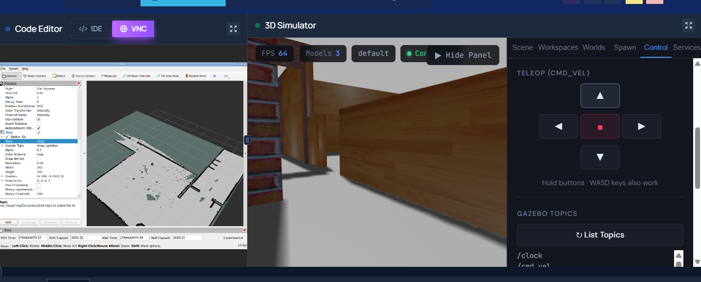

The map being built live while driving the robot through the house world
with keyboard teleop.

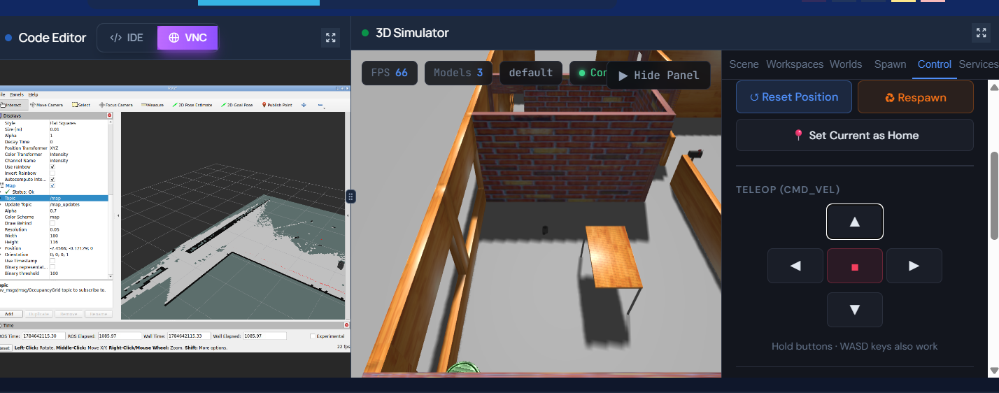

The finished, saved occupancy grid map of the house world.

### AMCL Localization on the House Map

**Wrong initial pose:**

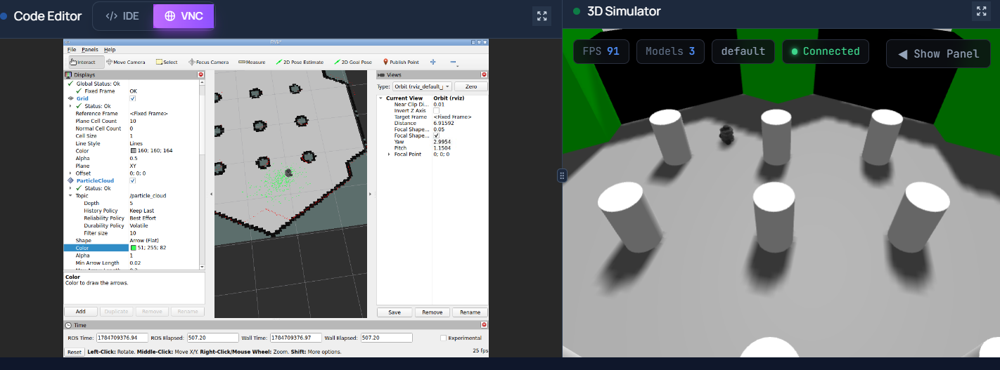

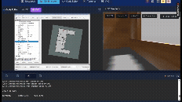

Full video: `robot_navigation/videos/2dposeWrong_house_map.mp4`

The LaserScan clearly did not match the map's walls at the incorrectly
selected pose, and the particle cloud remained scattered rather than
converging — consistent with the same local-search limitation of AMCL
observed in the main task.

**Correct initial pose:**

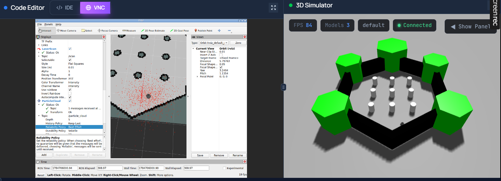

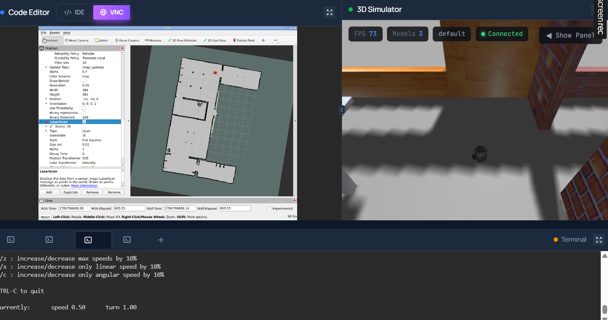

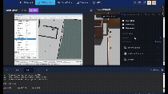

Full video: `robot_navigation/videos/2dpose_house_right.mp4`

Once the correct pose was provided, the particle cloud converged tightly
around the robot's true position, and the LaserScan aligned with the house
world's walls. Driving the robot around confirmed the alignment remained
stable throughout.

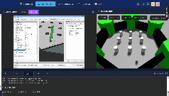

Full video: `robot_navigation/videos/map1_correctedpose.mp4`

## 8. Bonus (Custom World) — `obstacles.world`, Run Locally in Ubuntu

The ETGAH platform does not support uploading custom `.world` files or the
associated folders/extensions required to spawn a fully custom Gazebo
environment. To complete this part of the bonus challenge, the custom world
(`obstacles.world`) was built and tested locally in a native Ubuntu ROS 2
installation instead.

The full workflow — spawning TurtleBot3 in the custom world, mapping it with
SLAM Toolbox, saving the map, and localizing with AMCL — was carried out
successfully outside of ETGAH, with the world file and all supporting
screenshots/GIFs included in `custom_world/`.

### Spawning the Robot in the Custom World

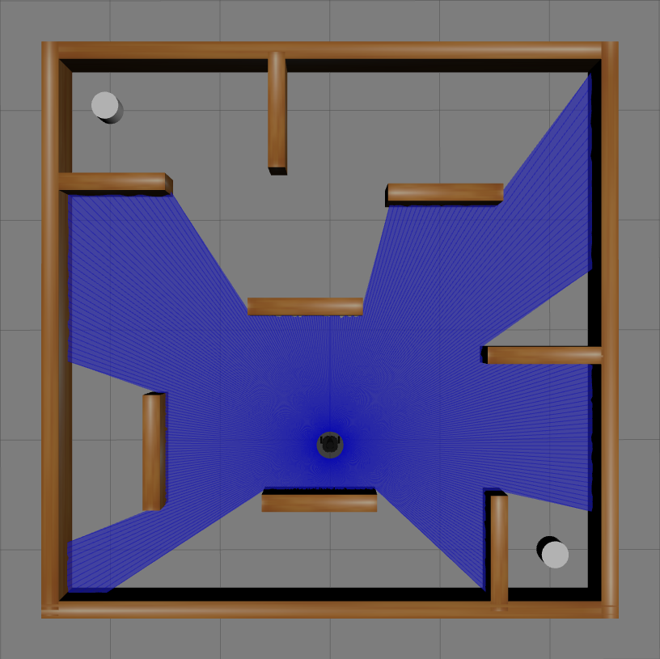

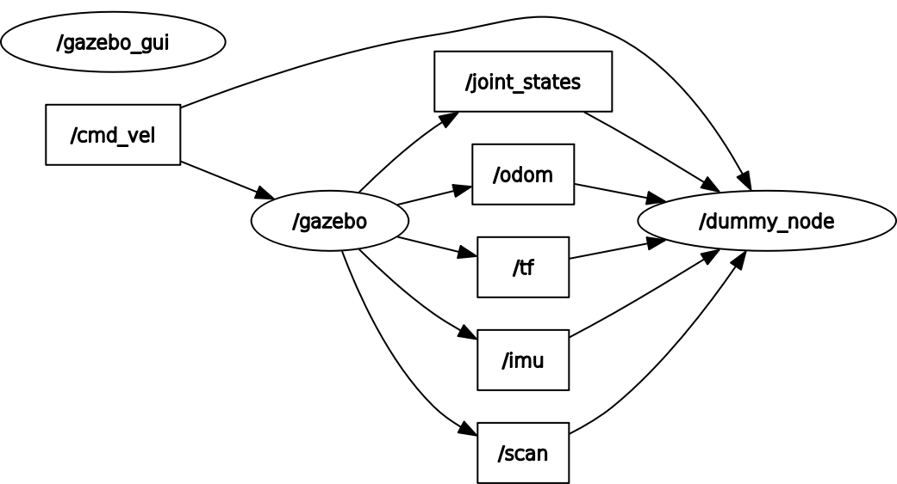

### Mapping the Custom World

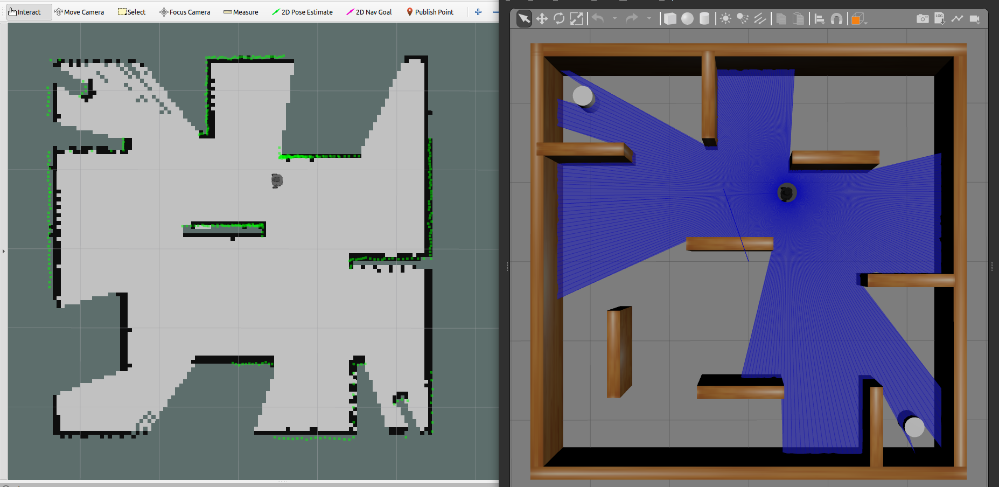

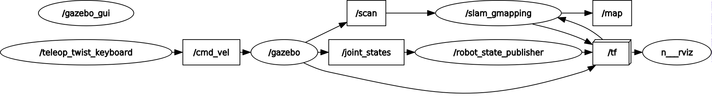

The robot was driven through the custom `obstacles.world` environment using
keyboard teleop while SLAM Toolbox built a live occupancy grid map, following
the same mapping process used for `turtlebot3_world` and `turtlebot3_house`.

### Localizing with AMCL in the Custom World

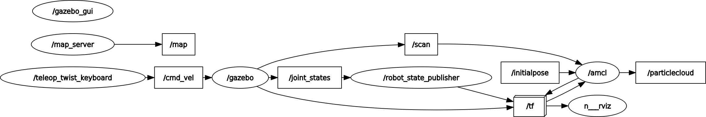


AMCL was launched against the saved custom-world map, an initial pose was
provided via 2D Pose Estimate, and the particle cloud converged correctly
around the robot's true position, confirming successful localization in a
fully custom environment.

## 9. TF Tree

Verified using:
```bash
ros2 run tf2_tools view_frames
```

```
map
 └── odom
      └── base_footprint
           └── base_link
                ├── wheel_left_link
                ├── wheel_right_link
                ├── caster_back_link
                ├── imu_link
                └── base_scan
```

- `map → odom`: published by AMCL. This transform is corrected whenever the
  particle filter's best pose estimate updates, representing how far the
  robot's raw odometry has drifted from its true position on the map.
- `odom → base_footprint`: published by TurtleBot3's own odometry system,
  based on wheel encoders.
- Everything from `base_footprint` downward matches TurtleBot3's standard
  frame structure.

Full PDF export: `robot_navigation/images/frames_AMCL.pdf`
PNG version: `robot_navigation/images/frames_AMCL.png`

## 10. Required Topic and Transform Outputs

### `/amcl_pose`

```
header:
  stamp:
    sec: 161
    nanosec: 200000000
  frame_id: map
pose:
  pose:
    position:
      x: 6.735980518450823
      y: 2.0075990515678708
      z: 0.0
    orientation:
      x: 0.0
      y: 0.0
      z: 0.5111176939225714
      w: 0.8595107346387667
  covariance: [0.018, -0.0057, 0.0, ..., 0.0245]
```

### `map → odom` transform (via `ros2 run tf2_ros tf2_echo map odom`)

```
At time 222.200000000
- Translation: [-2.118, -0.332, 0.000]
- Rotation: in Quaternion (xyzw) [0.000, 0.000, -0.046, 0.999]
- Rotation: in RPY (degree) [0.000, 0.000, -5.293]
```

### `/map` QoS (confirmed matched between publisher and subscribers)

```
Publisher (map_server): Reliability: RELIABLE, Durability: TRANSIENT_LOCAL
Subscriber (rviz):      Reliability: RELIABLE, Durability: TRANSIENT_LOCAL
Subscriber (amcl):      Reliability: RELIABLE, Durability: TRANSIENT_LOCAL
```

### `/particle_cloud` QoS (confirmed matched)

```
Publisher (amcl): Reliability: BEST_EFFORT, Durability: VOLATILE
Subscriber (rviz): Reliability: BEST_EFFORT, Durability: VOLATILE
```

### `/scan` and `/odom` availability

```bash
ros2 topic hz /scan
# average rate: ~18 Hz

ros2 topic hz /odom
# average rate: confirmed publishing
```


